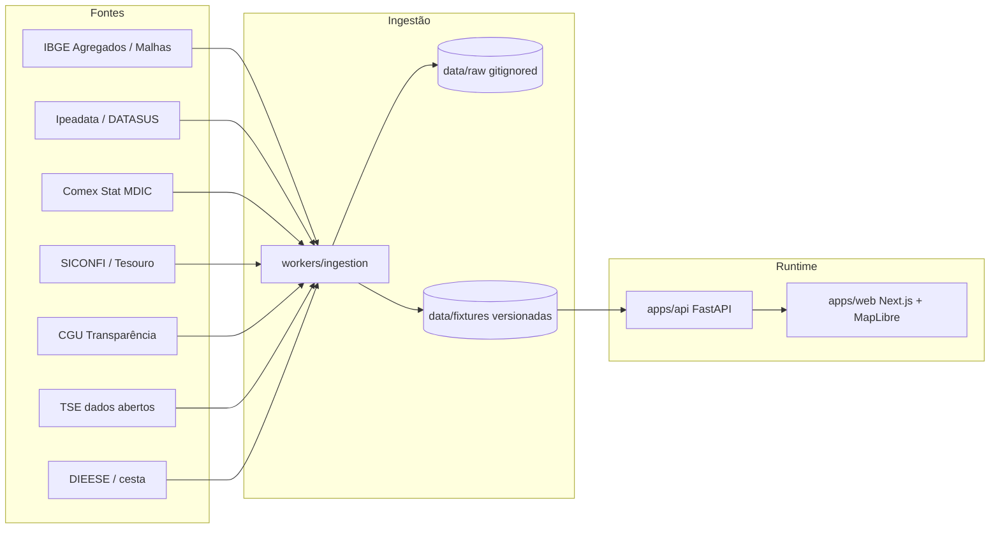

# Brasil Real

[](.github/workflows)
[](#arquitetura)
[](#camadas-no-mapa)
[](LICENSE)

> **Gêmeo digital exploratório do Brasil** — mapa vivo, números com fonte, simulações hipotéticas auditáveis.  
> **Não é** fonte oficial, parecer jurídico, previsão garantida nem sistema de decisão pública.

<p align="center">
  <a href="#o-que-%C3%A9"><strong>O que é</strong></a> ·
  <a href="#comece-em-5-minutos"><strong>Quickstart</strong></a> ·
  <a href="#camadas-no-mapa"><strong>Camadas</strong></a> ·
  <a href="#arquitetura"><strong>Arquitetura</strong></a> ·
  <a href="#ingest%C3%A3o--fontes-oficiais"><strong>Fontes</strong></a> ·
  <a href="#api"><strong>API</strong></a> ·
  <a href="#roadmap"><strong>Roadmap</strong></a>
</p>

---

## O que é

O **Brasil Real** trata o mapa como produto: você escolhe uma camada, pinta as 27 UFs, ordena o ranking, baixa um **dossiê** com fonte e clica para abrir a ficha (**definição, órgão, dataset, período e limitações**). Sem proveniência o valor **não aparece** (`fail closed`). Cobertura ≠ 27 UFs → camada vazia.

| Isso | Não isso |
|---|---|
| IBGE, TSE, SICONFI, CGU, Comex, IPEA/DATASUS, DIEESE | Número inventado ou “estimativa de IA” |
| Rótulos `OBSERVADO` / `ESTIMADO` / `DERIVADO` / `SEM DADO` | Lente ou variação vendida como fato IBGE |
| Lentes editoriais com pesos **declarados** | “Melhor estado” oficial / IDHM |
| Cenário fiscal **hipotético** (API + manifesto) | Parecer jurídico ou motor de decisão pública |

<details>
<summary><strong>Princípios duros</strong> (clique)</summary>

1. **Fonte antes de resposta** — todo número carrega organização + dataset + período.  
2. **Rótulos honestos** — `OBSERVADO`, `ESTIMADO`, `PROJETADO`, `SIMULADO`, `DERIVADO`, `SEM DADO`.  
3. **LLM não calcula impacto** — efeitos numéricos só em motores registrados.  
4. **Lei em texto ≠ lei em código** — catálogo jurídico sem fingir regras executáveis.  
5. **Nunca inventar dados** — sem canal oficial → backlog ou `SEM DADO`.

</details>

---

## Comece em 5 minutos

> Python **3.11–3.13** (recomendado **3.12**). Node 20+.  
> A API **sempre tenta o período mais recente** da fonte (IBGE com cache em `data/cache/`, TTL 12h). Sem rede → fixture. Nunca inventa.

<table>
<tr>
<td width="50%">

### 1. API

```bash
cd apps/api
py -3.12 -m venv .venv
# Windows
.venv\Scripts\activate
pip install -r requirements.txt
pytest -q
uvicorn app.main:app --reload --port 8000
```

</td>
<td width="50%">

### 2. Web

```bash
cd apps/web
npm install
npm run dev -- --port 3010
```

Abra **http://localhost:3010**

API docs: **http://localhost:8000/docs**

</td>
</tr>
</table>

No desenvolvimento local, **não** defina `NEXT_PUBLIC_API_URL` — o Next faz proxy same-origin de `/v1/*` (evita CORS).

### Produção (Firebase)

- **Site:** https://brasilreal-atlas.web.app  
- **API:** https://brasil-real-api-928790342045.southamerica-east1.run.app  
- Vista compartilhada: `?camada=&ano=&uf=&recorte=&modo=&vs=&sim=1` na home. `sim=1` abre o fundo hipotético (rótulo SIMULADO).  
- Redeploy: [`docs/deploy-firebase.md`](docs/deploy-firebase.md) ou `scripts/deploy-firebase.ps1``

<details>
<summary><strong>Docker Compose</strong> (web + api + Postgres/PostGIS)</summary>

```bash
cp .env.example .env
docker compose up --build
```

| Serviço | URL |
|---|---|
| Web | http://localhost:3000 |
| API | http://localhost:8000/docs |
| Postgres | `localhost:5432` |

O MVP lê **fixtures** em `data/fixtures`. O Postgres prepara o schema para fases seguintes.

</details>

<details>
<summary><strong>Atualizar dados oficiais (ingestão)</strong></summary>

```bash
cd workers/ingestion
python run.py --source ibge          # pop, PIB, social, lentes derivadas
python run.py --source territory
python run.py --source ipeadata
python run.py --source comex --comex-from 2022
python run.py --source siconfi
python run.py --source tse
# ou
python run.py --all
```

Snapshots brutos vão para `data/raw/` (gitignored). Fixtures validadas em `data/fixtures/`.

</details>

---

## Camadas no mapa

Cada camada exige tooltip com definição + fonte. **27 UFs ou vazio.** Lentes e razões (RCL/hab, FOB/hab, DCL/RCL) são `DERIVADO`.

| Grupo | O que pinta | Origem |
|---|---|---|
| **Lentes** | Morar, empreender, criança, pressão etária | Receita editorial (pesos iguais) sobre camadas oficiais |
| **Economia** | PIB, PIB/hab, renda, salário formal, Gini, pobreza, desocupação, informalidade, abertura/sobrevivência de empresas | IBGE (SCN, PNAD, Cempre, Demografia) |
| **Fiscal** | RCL, tributária, transferências correntes da União (RREO estado), despesa empenhada, DCL, RCL/hab, DCL/RCL, tributária/RCL | SICONFI RREO |
| **União (CGU)** | Transferências ao favorecido na UF, constitucionais/royalties, R$/hab | Portal da Transparência — UF do favorecido ≠ gasto no território |
| **Custo na capital** | Cesta básica e cesta / SM | DIEESE (preço da **capital**, não do interior) |
| **Moradia** | Alugado / próprio pagando / próprio quitado | Censo 2022 |
| **Território** | População, densidade, área, idade, natalidade/mortalidade, urbano, dependência | IBGE |
| **Gerações** | Fatias etárias Alpha → 80+ | Censo 2022 |
| **Social / saneamento** | Esgoto, água, lixo, internet, alfabetização, superior completo | Censo / PNAD |
| **Saúde** | Hipertensão, diabetes, tabaco, álcool, plano | PNS 2019 |
| **Segurança** | Homicídios /100 mil, trânsito /100 mil, violência 12 meses | Ipeadata ← SIM · PNS |
| **Exportações (FOB)** | Total, /hab, soja, farelo, óleo, milho, carnes, bovina, minérios, combustíveis | Comex Stat / MDIC |
| **Eleições** | % do vencedor e margem (presidente e governador) | TSE dados abertos |
| **Povos** | Indígenas, quilombolas, parda/branca/preta | Censo 2022 |

Na **ficha da UF** (não são camadas do mapa): bioma predominante, costeiro/marinho, demais atributos territoriais.

O botão **Dossiê** gera um ZIP (`LEIA-ME.md` + CSV + `proveniencia.json`) da vista ou da série oficial — sempre com órgão, período e limites.

<details>
<summary><strong>O que ainda NÃO entra no mapa (honestidade)</strong></summary>

| Ideia | Motivo |
|---|---|
| IDEB por UF | Download oficial INEP instável; sem 27 UFs validados → não pintar |
| COVID casos/óbitos | APIs do painel MS / OpenDataSUS sem canal estável aberto |
| Processos judiciais | CNJ DataJud exige credencial |
| Milionários / bilionários por UF | Sem agregado oficial; listas privadas ≠ fonte do produto |
| APP (preservação permanente) completa | Sem série oficial limpa por UF pronta para choropleth |
| Consumo de carne | POF — validar granularidade UF vs região |

Sem canal oficial reproduzível → `SEM DADO` ou backlog. Nunca inventar.

</details>

---

## Arquitetura



```text
BrasilReal/
├── apps/
│   ├── web/          # Next.js 15 · MapLibre · ranking · dossiê
│   └── api/          # FastAPI · fixtures · motor de cenário
├── workers/ingestion # Conectores oficiais idempotentes
├── data/fixtures/    # Artefatos validados (commitados)
├── data/raw/         # Snapshots brutos (gitignored)
├── docs/             # Visão, ADRs, fontes, roadmap
├── infra/            # Docker / compose auxiliares
└── AGENTS.md         # Regras para agentes de código
```

| Peça | Tecnologia |
|---|---|
| Mapa | MapLibre GL (sem chave proprietária) |
| Front | Next.js (App Router), TypeScript |
| API | FastAPI, Pydantic, pytest |
| Dados | Fixtures JSON + ingestão Python (`urllib`) |
| Cenário | Motor determinístico de rateio hipotético + manifesto |

---

## Ingestão & fontes oficiais

Pipeline: **API/arquivo oficial → snapshot bruto + checksum → fixture validada → API do produto**.

| Domínio | Canal | Status |
|---|---|---|
| População / PIB / social / Censo | [IBGE Agregados](https://servicodados.ibge.gov.br/api/docs/agregados) | Automatizado |
| Malha UF / município / macrorregião | [IBGE Malhas](https://servicodados.ibge.gov.br/api/docs/malhas) | Automatizado |
| Homicídios / trânsito | [Ipeadata](http://www.ipeadata.gov.br/) (SIM/DATASUS) | Automatizado |
| Exportações FOB | [Comex Stat](https://comexstat.mdic.gov.br/) / [API MDIC](https://api-comexstat.mdic.gov.br/docs) | Automatizado |
| Fiscal (SICONFI) | [SICONFI](https://apidatalake.tesouro.gov.br/docs/siconfi/) | RREO 27 UFs no mapa |
| Transferências União (CGU) | [Portal da Transparência](https://portaldatransparencia.gov.br/download-de-dados/transferencias) | UF do favorecido, não gasto territorializado |
| Eleições | [TSE Dados Abertos](https://dadosabertos.tse.jus.br/) | Presidência e governo UF |
| Cesta básica | DIEESE | Capital da UF, não interior |
| Povos / ficha territorial | Censo 9718, 9727, 1301, biomas FTP | Mapa + ficha |

Matriz completa, limitações e backlog: **[`docs/data-sources.md`](docs/data-sources.md)**.

<details>
<summary><strong>Comandos de ingestão por fonte</strong></summary>

```bash
cd workers/ingestion
python run.py --source ibge --ibge-pop 2025   # inclui social + lentes DERIVADO
python run.py --source territory
python run.py --source ipeadata          # ~2 min (séries grandes)
python run.py --source comex --comex-from 2022
python run.py --source siconfi
python run.py --source tse
python run.py --source tesouro
python run.py --source transparencia   # CGU Transferencias, ~24 zips/ano; cache em data/raw/
```

- **Ipeadata:** OData não filtra por UF; o conector baixa a série e seleciona `NIVNOME=Estados`.  
- **Comex:** só anos-civis completos; UF sem operação = `0` declarado; “Não Declarada” fora do mapa.  
- **TSE:** votos presidente/governador por UF; ZZ/VT fora.  
- **Lentes:** min-max 0–100 com pesos iguais; status `DERIVADO`.  
- **SICONFI vs CGU:** RREO = o que o *estado* registrou como recebido da União. CGU = o que a União registrou como transferido a favorecidos com UF preenchida (estado + municípios + outros). Não são a mesma série e não se reconcilia automaticamente.

</details>

---

## API

Prefixo `/v1`. OpenAPI em `/docs`.

| Método | Rota | Uso |
|---|---|---|
| `GET` | `/v1/indicators` | Lista camadas (grupo, unidade, proveniência) |
| `GET` | `/v1/indicators/{id}/periods` | Anos/períodos válidos |
| `GET` | `/v1/observations?indicator=&period=` | Valores por UF |
| `GET` | `/v1/geographies` | 27 UFs |
| `GET` | `/v1/geographies/{code}/profile` | Ficha da UF |
| `GET` | `/v1/geographies/municipalities/{code}/profile` | Ficha municipal (território) |
| `GET` | `/v1/geographies/states/{uf}/municipalities` | Malha + pop. no zoom |
| `POST` | `/v1/scenarios` · `…/run` · `…/manifest` | Cenário hipotético auditável |

Testes:

```bash
cd apps/api
pytest -q
```

---

## UX do mapa (resumo)

- Mapa **full-bleed**; ranking à esquerda; controles e ficha à direita.  
- **Leitura** (lente ou métrica) + recorte (Brasil, macrorregião, litoral, fronteira) + nível/variação.  
- Zoom afastado → **5 macrorregiões IBGE** (soma se aditivo; média ponderada pela pop. se taxa/%).  
- Zoom médio → UF, intermediária, capitais. Municípios só em População, com UF selecionada.  
- **Dossiê** — ZIP da vista ou da série oficial, com carta de proveniência.  
- Todo número com **InfoTip** (definição + fonte + limitações).
- **App (PWA):** instalar na tela inicial; cada publicação troca o pacote. Indicadores oficiais não ficam cacheados no aparelho.

---

## Roadmap

| Fase | Foco |
|---|---|
| **1** ✓ | Fundação: 27 UFs, mapa, proveniência, cenário hipotético |
| **2** | **Onda 1 no mapa:** SICONFI/RREO 27 UFs + CGU transferência ao favorecido. Ainda não: ReceitaData, gasto federal territorializado, reconciliação União↔UF |
| **3** | Regras federais selecionadas (rules-as-code + vigência) |
| **4** | Municípios + população sintética |
| **5** | Educação, saúde, trabalho, infraestrutura (PNS/saneamento já no mapa; IDEB só com 27 UFs oficiais) |
| **6** | Agentes / choques (só após calibração) |
| **7** | Cobertura jurídica federativa |

Detalhes: [`docs/roadmap.md`](docs/roadmap.md) · [`docs/implementation-plan.md`](docs/implementation-plan.md)

---

## Documentação técnica

| Doc | Conteúdo |
|---|---|
| [`docs/data-sources.md`](docs/data-sources.md) | Matriz de fontes, ingestão, backlog honesto |
| [`docs/roadmap.md`](docs/roadmap.md) | Fases do produto |
| [`docs/implementation-plan.md`](docs/implementation-plan.md) | Aceite Fase 1 |
| [`docs/adr/`](docs/adr/) | Decisões de arquitetura (stack, LLM boundary…) |
| [`AGENTS.md`](AGENTS.md) | Regras para agentes de código neste repo |

---

## Referências oficiais (entrada)

- [IBGE — API de Agregados](https://servicodados.ibge.gov.br/api/docs/agregados)  
- [IBGE — Localidades](https://servicodados.ibge.gov.br/api/docs/localidades) · [Malhas](https://servicodados.ibge.gov.br/api/docs/malhas)  
- [SIDRA](https://sidra.ibge.gov.br/) (tabelas 6579, 5938, 5877, 9543, 4099, 9718, 9727, 1301…)  
- [Ipeadata](http://www.ipeadata.gov.br/) · séries Atlas da Violência / SIM  
- [Comex Stat (MDIC)](https://comexstat.mdic.gov.br/) · [API ComexStat](https://api-comexstat.mdic.gov.br/docs)  
- [SICONFI — API Tesouro](https://apidatalake.tesouro.gov.br/docs/siconfi/)  
- [TSE Dados Abertos](https://dadosabertos.tse.jus.br/)  
- [DIEESE — cesta básica](https://www.dieese.org.br/)  
- [Tesouro Transparente — transferências](https://www.tesourotransparente.gov.br/ckan/dataset/api-de-transferencias-constitucionais)  
- [FUNAI — geoprocessamento / terras indígenas](https://www.gov.br/funai/pt-br/atuacao/terras-indigenas/geoprocessamento-e-mapas) *(próximas camadas de área TI)*

---

## Contribuindo

1. Preferir o próximo item da **Fase atual** do roadmap.  
2. Diffs cirúrgicos — sem docs “por precaução”.  
3. Toda nova camada precisa de **definition + source + limitations** antes da UI.  
4. Não commitar `.env`, `scratch/`, `data/raw/`, `*_log.txt`, credenciais.  
5. Rodar `pytest` na API após mudanças de store/ingestão.

---

## Licença

Código sob [MIT](LICENSE).  
Os **dados** pertencem aos órgãos oficiais citados; respeite os termos de cada portal. Este repositório republica agregados para fins educacionais/exploratórios com proveniência explícita.

---

<p align="center">
  <em>Mapa primeiro. Fonte sempre. Simulação nunca disfarçada de fato.</em>
</p>
