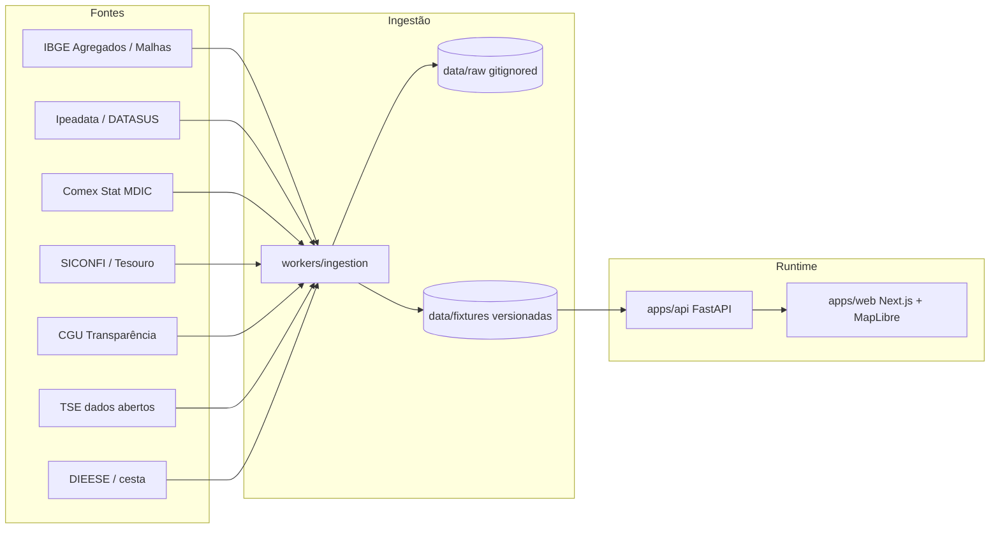

# Brasil Real

[](https://github.com/leonardolauriquer/BrasilReal/actions)
[](https://brasilreal-atlas.web.app)
[](#camadas-no-mapa)
[](LICENSE)

**Gêmeo digital exploratório do Brasil** — 27 UFs, números com fonte, simulação hipotética nunca disfarçada de fato.

Não é órgão oficial, parecer jurídico, IDHM nem sistema de decisão pública.

<p align="center">
  <a href="https://brasilreal-atlas.web.app"><strong>Abrir o atlas</strong></a>
  ·
  <a href="https://brasil-real-api-928790342045.southamerica-east1.run.app/docs"><strong>API</strong></a>
  ·
  <a href="#comece-em-5-minutos"><strong>Rodar local</strong></a>
  ·
  <a href="#camadas-no-mapa"><strong>Camadas</strong></a>
  ·
  <a href="#o-que-o-mapa-recusa"><strong>O que recusamos</strong></a>
</p>

---

## O que é

Você escolhe uma **camada**, pinta as 27 Unidades da Federação, lê o ranking, compara UFs e abre a ficha: **definição, órgão, dataset, período e limitações**. Sem proveniência o valor **não aparece** (`fail closed`). Sem as 27 UFs a camada fica **vazia** — nunca interpolamos célula faltante.

| Isso | Não isso |
|---|---|
| IBGE, TSE, SICONFI, CGU, Comex, IPEA/DATASUS, DIEESE | Número inventado ou «estimativa de IA» |
| Rótulos `OBSERVADO` / `ESTIMADO` / `DERIVADO` / `SEM DADO` | Lente ou variação vendida como fato IBGE |
| Lentes com **pesos declarados** (receita editorial) | «Melhor estado» oficial / IDHM |
| Cenário fiscal **hipotético** (API + manifesto) | Motor de decisão pública |

<details>
<summary><strong>Princípios</strong></summary>

1. **Fonte antes de resposta** — organização + dataset + período em todo número.  
2. **Rótulos honestos** — `OBSERVADO`, `ESTIMADO`, `PROJETADO`, `SIMULADO`, `DERIVADO`, `SEM DADO`.  
3. **LLM não calcula impacto** — efeitos numéricos só em motores registrados.  
4. **Lei em texto ≠ lei em código.**  
5. **Sem canal oficial reproduzível → `SEM DADO`.** Nunca inventar.

</details>

---

## Atlas no ar

| | |
|---|---|
| Mapa | https://brasilreal-atlas.web.app |
| API | https://brasil-real-api-928790342045.southamerica-east1.run.app |
| OpenAPI | https://brasil-real-api-928790342045.southamerica-east1.run.app/docs |

Vista compartilhável na home: `?camada=&ano=&uf=&recorte=&modo=&vs=&sim=1`.  
`sim=1` abre o recorte hipotético, sempre rotulado **SIMULADO**.

PWA instalável; cada publicação troca o pacote. Indicadores oficiais **não** ficam cacheados no aparelho.

Redeploy: [`docs/deploy-firebase.md`](docs/deploy-firebase.md) ou `scripts/deploy-firebase.ps1`.

---

## Comece em 5 minutos

Python **3.12** (3.11–3.13 ok). Node 20+.  
A API tenta o **período mais recente** da fonte (IBGE com cache em `data/cache/`, TTL 12h). Sem rede → fixture. Nunca inventa.

<table>
<tr>
<td width="50%">

### 1. API

```bash
cd apps/api
py -3.12 -m venv .venv
.venv\Scripts\activate   # Windows
pip install -r requirements.txt
pytest -q
uvicorn app.main:app --reload --port 8000
```

</td>
<td width="50%">

### 2. Web

```bash
cd apps/web
npm install
npm run dev -- --port 3010
```

Abra **http://localhost:3010**  
Docs da API: **http://localhost:8000/docs**

</td>
</tr>
</table>

No local, **não** defina `NEXT_PUBLIC_API_URL` — o Next faz proxy same-origin de `/v1/*`.

<details>
<summary><strong>Docker Compose</strong></summary>

```bash
cp .env.example .env
docker compose up --build
```

| Serviço | URL |
|---|---|
| Web | http://localhost:3000 |
| API | http://localhost:8000/docs |
| Postgres | `localhost:5432` |

O MVP lê **fixtures** em `data/fixtures`. O Postgres prepara o schema para fases seguintes.

</details>

<details>
<summary><strong>Atualizar dados oficiais</strong></summary>

```bash
cd workers/ingestion
python run.py --source ibge
python run.py --source ipeadata   # séries grandes (~2 min)
python run.py --source siconfi
python run.py --source transparencia
python run.py --all
```

Snapshots brutos: `data/raw/` (gitignored). Fixtures validadas: `data/fixtures/` (commitadas).

</details>

---

## Camadas no mapa

Cada camada exige tooltip com definição + fonte. **27 UFs ou vazio.** Razões (RCL/hab, FOB/hab, DCL/RCL, trib/PIB) e lentes são `DERIVADO`.

| Grupo | O que pinta | Origem |
|---|---|---|
| **Lentes** | Morar, empreender, criança, pressão etária | Receita editorial, pesos iguais, min–máx 0–100. Ficha declara a mistura |
| **Economia** | PIB, PIB/hab, peso no PIB Brasil, renda, CEMPRE (salário, empresas, empregos), abertura/sobrevivência, Gini, pobreza, desocupação, **ocupação**, **participação**, informalidade | IBGE (contas regionais, PNAD, CEMPRE) |
| **Fiscal** | RCL, receita tributária, **impostos** (conta consolidada), trib/hab, trib/PIB, trib/RCL, transf. União (RREO), despesa empenhada, DCL | SICONFI RREO 6º bimestre |
| **União (CGU)** | Transferências ao favorecido na UF, constitucionais/royalties, R$/hab | Portal da Transparência. UF do favorecido **≠** gasto no território |
| **Custo na capital** | Cesta básica e cesta / SM | DIEESE — preço da **capital**, não do interior |
| **Moradia** | Alugado / próprio pagando / próprio quitado | Censo 2022 |
| **Território** | População, densidade, área, idade, natalidade/mortalidade, urbano, dependência | IBGE |
| **Gerações** | Fatias etárias Alpha → 80+ | Censo 2022 |
| **Social / saneamento** | Esgoto, água, lixo, internet, alfabetização, superior completo | Censo / PNAD |
| **Saúde** | Hipertensão, diabetes, tabaco, álcool, plano | PNS 2019 |
| **Segurança** | Homicídios (taxa e nº), homicídios de **mulheres** (nº SIM), violência física/psicológica/sexual (PNS), trânsito | Ipeadata ← SIM · PNS 2019 |
| **Exportações (FOB)** | Total, /hab, soja, farelo, óleo, milho, carnes, bovina, minérios, combustíveis | Comex Stat / MDIC |
| **Eleições** | % do vencedor e margem (presidente e governador) | TSE |
| **Povos** | Indígenas, quilombolas, parda/branca/preta | Censo 2022 |

Na **ficha da UF** (não são camadas): bioma, costeiro/marinho, demais atributos territoriais.

**Dossiê** gera ZIP (`LEIA-ME.md` + CSV + `proveniencia.json`) da vista ou da série oficial.

### Lentes (não são ranking oficial)

Quatro notas 0–100 entre as 27 UFs, pesos iguais entre blocos, cada camada em min–máx. Anos mistos (usa o *latest* de cada fonte). A cesta DIEESE **não entra** (é capital, não UF).

| Lente | Entra | Não entra |
|---|---|---|
| Morar | Renda, pobreza invertida, ocupação, homicídios/trânsito, violência física e psicológica PNS, serviços, RCL/hab | Feminicídio penal, assalto/BO, impostos em R$ bruto |
| Empreender | Abertura e sobrevivência de empregadoras, PIB/hab, salário formal, ocupação/participação, densidade de empresas **e** empregos formais / mil hab. | Tributária/PIB (não é carga do empreendedor), contagem absoluta de empresas |
| Criança | Renda, ocupação, homicídio/trânsito, violência física **entre mulheres** (PNS), serviços/RCL | IDEB, feminicídio da Lei 13.104, nº absoluto de homicídios femininos |
| Pressão etária | 60+, índice de envelhecimento, dependência *(maior = mais pressão)* | «Melhor para idoso» / qualidade do SUS |

---

## O que o mapa recusa

Sem canal oficial com **27 UFs** reproduzíveis, a célula não existe. Não «completamos» com modelo.

| Ideia comum | Por que não pinta com esse nome |
|---|---|
| Feminicídio (Lei 13.104) | O SIM/Ipeadata publica **homicídios do sexo feminino**, não a categoria penal |
| Assalto / roubo a pessoa | SIDRA não tem série UF; SINESP VDE sem extração estável neste corte. O mais próximo é violência **física autorreferida** da PNS 2019 |
| ICMS / IPVA isolados | A API SICONFI devolve a conta consolidada **Impostos** nas 27 UFs |
| Arrecadação federal da RFB por UF | ReceitaData ainda sem conector fail-closed |
| IDEB por UF | Download INEP instável; sem 27 UFs validados |
| COVID casos/óbitos | Painel MS / OpenDataSUS sem canal estável |
| Processos judiciais | CNJ DataJud autenticado |
| Milionários por UF | Sem agregado oficial |
| Consumo de carne | POF — granularidade UF ainda não fechada |

---

## Arquitetura



```text
BrasilReal/
├── apps/web          # Next.js 15 · MapLibre · ranking · PWA
├── apps/api          # FastAPI · fixtures · cenário hipotético
├── workers/ingestion # Conectores oficiais idempotentes
├── data/fixtures/    # Artefatos validados (commitados)
├── data/raw/         # Snapshots brutos (gitignored)
├── docs/             # Fontes, ADRs, roadmap
└── AGENTS.md         # Regras para agentes neste repo
```

Integridade: soma população/PIB = totais oficiais; CI valida fixtures + `MANIFEST.json`; canário pós-deploy na API pública.

---

## Ingestão

Pipeline: **API/arquivo oficial → snapshot bruto + checksum → fixture validada → API**.

| Domínio | Canal | Status |
|---|---|---|
| População / PIB / PNAD / Censo / PNS / CEMPRE | [IBGE Agregados](https://servicodados.ibge.gov.br/api/docs/agregados) / SIDRA | Automatizado |
| Homicídios, trânsito, homicídios de mulheres (nº) | [Ipeadata](http://www.ipeadata.gov.br/) ← SIM/DATASUS | Automatizado |
| Fiscal estadual | [SICONFI](https://apidatalake.tesouro.gov.br/docs/siconfi/) | RREO 27 UFs |
| Transferências União | [CGU](https://portaldatransparencia.gov.br/download-de-dados/transferencias) | Favorecido ≠ território |
| Exportações FOB | [Comex Stat](https://comexstat.mdic.gov.br/) | Automatizado |
| Eleições | [TSE](https://dadosabertos.tse.jus.br/) | Presidente e governador |
| Cesta básica | DIEESE | Capital da UF |

Matriz e limitações: [`docs/data-sources.md`](docs/data-sources.md).

```bash
cd workers/ingestion
python run.py --source ibge --ibge-pop 2025
python run.py --source ipeadata
python run.py --source siconfi
python run.py --source transparencia   # CGU, ~24 zips/ano
python run.py --source comex --comex-from 2022
python run.py --source tse
```

- **Ipeadata:** o OData não filtra UF; o conector baixa a série e seleciona `NIVNOME=Estados`.  
- **SICONFI vs CGU:** RREO = o que o *estado* registrou como recebido. CGU = o que a União registrou como transferido a favorecidos com UF. Não reconcilia sozinho.  
- **Lentes:** recalculadas na ingestão IBGE (`DERIVADO`).

---

## API

Prefixo `/v1`. OpenAPI em `/docs`.

| Método | Rota | Uso |
|---|---|---|
| `GET` | `/v1/indicators` | Camadas (grupo, unidade, proveniência) |
| `GET` | `/v1/indicators/{id}/periods` | Períodos válidos |
| `GET` | `/v1/observations?indicator=&period=` | Valores por UF |
| `GET` | `/v1/geographies` | 27 UFs |
| `GET` | `/v1/geographies/{code}/profile` | Ficha da UF |
| `POST` | `/v1/scenarios` · `…/run` · `…/manifest` | Cenário hipotético auditável |

```bash
cd apps/api
pytest -q
```

---

## UX

- Mapa full-bleed; ranking à esquerda; ficha à direita. No celular, a camada abre em *sheet*.  
- **Leitura** (lente ou métrica) + recorte (Brasil, macrorregião, litoral, fronteira) + nível/variação.  
- Busca de camada e UF (`/`), comparar 2–3 estados, sparkline da série oficial, exportar PNG com rodapé de proveniência.  
- Teclado: `Esc`, `/`, setas, `1–4` nas lentes.  
- URL da vista para compartilhar. Modo **SIMULADO** isolado (fundo hipotético).  
- Zoom afastado → 5 macrorregiões IBGE (soma se aditivo; média ponderada pela pop. se taxa/%). Municípios só em População, com UF selecionada.

---

## Roadmap

| Fase | Foco |
|---|---|
| **1** ✓ | Fundação: 27 UFs, mapa, proveniência, cenário hipotético |
| **2** | Fiscal observado no mapa (RREO + CGU). Ainda não: ReceitaData, gasto federal territorializado |
| **3** | Regras federais selecionadas (rules-as-code) |
| **4** | Municípios + população sintética |
| **5** | Educação (IDEB só com 27 UFs oficiais) |
| **6–7** | Agentes / cobertura jurídica — só após calibração |

[`docs/roadmap.md`](docs/roadmap.md) · [`docs/implementation-plan.md`](docs/implementation-plan.md)

---

## Docs

| Arquivo | Conteúdo |
|---|---|
| [`docs/data-sources.md`](docs/data-sources.md) | Matriz de fontes e backlog honesto |
| [`docs/adr/`](docs/adr/) | Decisões de arquitetura |
| [`AGENTS.md`](AGENTS.md) | Regras para agentes neste repo |

Fontes de entrada: [IBGE Agregados](https://servicodados.ibge.gov.br/api/docs/agregados) · [SIDRA](https://sidra.ibge.gov.br/) · [Ipeadata](http://www.ipeadata.gov.br/) · [SICONFI](https://apidatalake.tesouro.gov.br/docs/siconfi/) · [Comex Stat](https://comexstat.mdic.gov.br/) · [TSE](https://dadosabertos.tse.jus.br/) · [CGU Transferências](https://portaldatransparencia.gov.br/download-de-dados/transferencias) · [DIEESE](https://www.dieese.org.br/)

---

## Contribuindo

1. Preferir o próximo item da fase atual do roadmap.  
2. Diffs cirúrgicos — sem docs «por precaução».  
3. Nova camada: `definition` + `source` + `limitations` **antes** da UI.  
4. Não commitar `.env`, `scratch/`, `data/raw/`, `*_log.txt`, credenciais.  
5. `pytest` na API após mudança de store/ingestão.

---

## Licença

Código: [MIT](LICENSE).  
Os **dados** pertencem aos órgãos citados; este repositório republica agregados com proveniência explícita, para exploração educacional.

<p align="center"><em>Mapa primeiro. Fonte sempre. Simulação nunca disfarçada de fato.</em></p>
