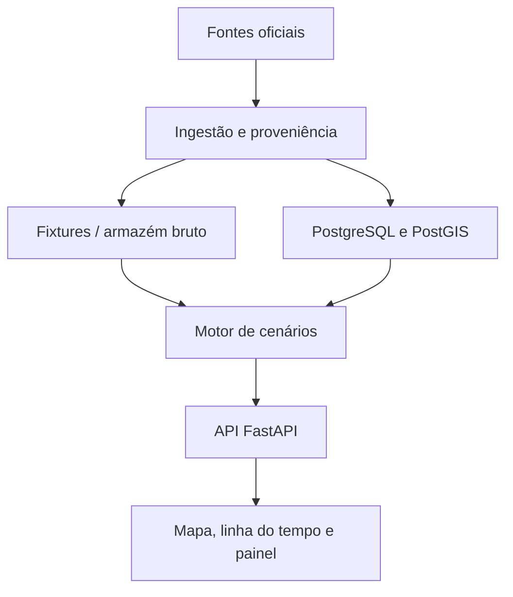

# Arquitetura

## Diagrama lógico

## Limites dos componentes

| Componente | Responsabilidade | Não faz |
|---|---|---|
| `apps/web` | UX, mapa, tabela acessível, export | Cálculo de impacto |
| `apps/api` | Consultas, orquestração, manifesto | Scraping ad hoc em request |
| `workers/ingestion` | Conectores idempotentes | Alterar regras publicadas |
| `services/fund_engine` | Rateio contábil determinístico | Efeitos comportamentais |
| PostgreSQL/PostGIS | Schema durável (próximas fases) | Substituir fixtures no MVP |

## Runtime do MVP

A API sobe em modo `fixtures`: carrega `data/fixtures/ibge/population_uf_2025.json` e o catálogo legal. O Postgres sobe no Compose para validar o caminho de migrations; a leitura pública do MVP não depende dele.
